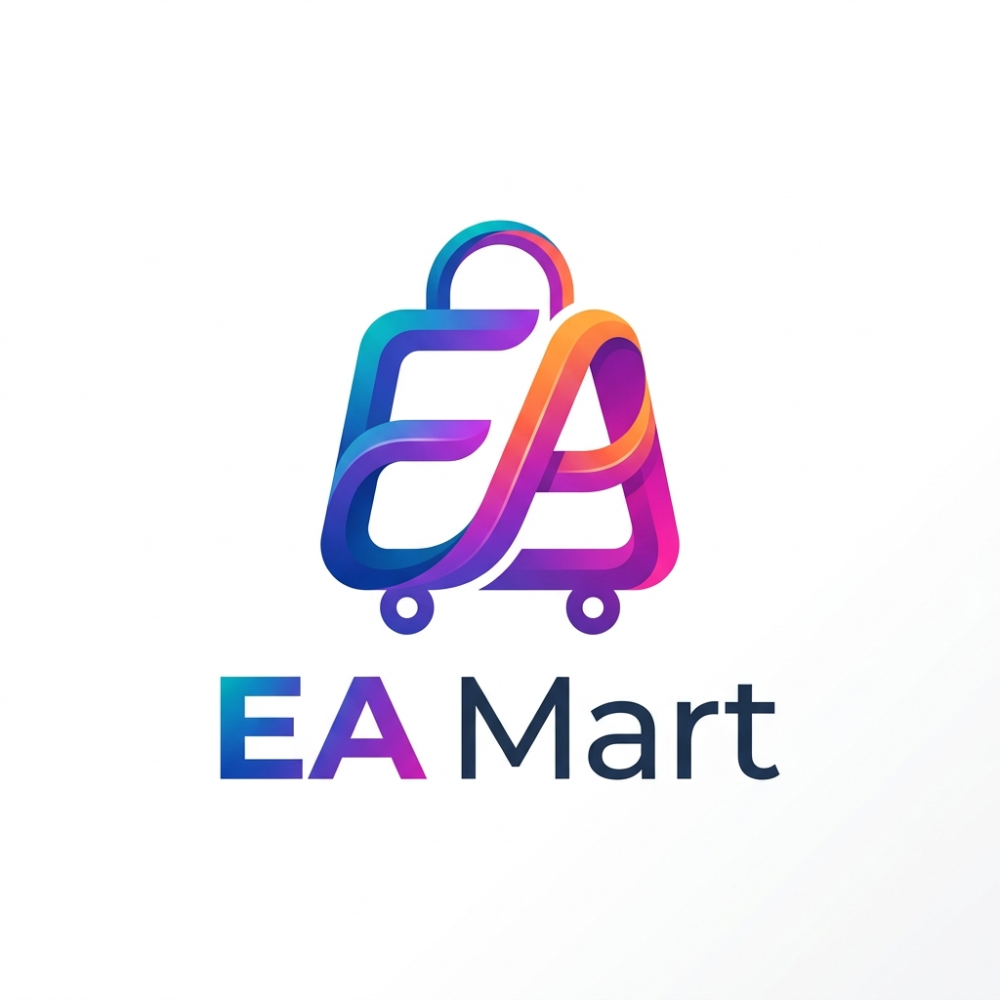

  
  
  # 🛍️ ✨ EA Mart ✨ 🛍️

  

    <strong>A next-generation, premium Django e-commerce platform built for scale, speed, and beautiful user experiences.</strong>
  

  

    
    
    
    
    
    
  

---

## 🌟 Why EA Mart?

EA Mart isn't just another e-commerce site. It's a complete, feature-rich store featuring a **premium responsive interface**, a **session-aware shopping cart**, **secure account flows**, and **transaction-safe Cash on Delivery** checkout.

Whether you're shopping as a guest or a registered user, EA Mart guarantees a buttery-smooth experience across all devices! 📱💻

---

## 🚀 Epic Features

- 🎨 **Premium Storefront** — Highly responsive product grids, intuitive search, category/price filters, sorting, pagination, and stunning product galleries!
- 🛒 **Smart Shopping Cart** — Guest carts use Django sessions, while account carts are securely saved in the database. When a guest logs in, their cart magically merges! ✨
- 🔐 **Secure Order Processing** — Login-gated checkout, server-calculated prices, row-locked stock validation, atomic order creation, and inventory reduction.
- 👑 **Custom Admin Dashboard** — A completely **custom, enhanced Admin Panel** designed specifically for store owners. Manage products, track orders, view galleries, and update statuses with ease!
- 📱 **Mobile-First Approach** — Flawless UI/UX on smartphones and tablets, featuring off-canvas menus and touch-friendly product galleries.
- ⚡ **Optimized Performance** — Efficient database queries, lazy-loaded assets, and streamlined logic make the application incredibly fast!
- 🔄 **Real-Time Price Calculation** — Dynamic cart totals, shipping calculations, and discounts update seamlessly as you shop.
- 🐳 **Dockerized Setup** — Fully containerized environment for seamless deployment and local development. Run the whole stack with one command!
- ☁️ **Cloud Storage Integration** — Integrated with **Cloudinary** for lightning-fast, highly optimized product images globally!
- 🐘 **Robust Database** — Powered by **PostgreSQL** for maximum reliability and concurrency handling.
- 🚀 **Vercel Ready** — Comes fully pre-configured (`vercel.json` included) for zero-downtime serverless deployments on **Vercel**!

---

## 🛠️ The Ultimate Tech Stack

| Technology | Role |
| :--- | :--- |
| **🐍 Python & Django** | Backend Logic & MVC Framework |
| **🎨 HTML5, CSS3, JS** | Beautiful, vanilla frontend interactions |
| **🐘 PostgreSQL** | Production-ready Relational Database |
| **☁️ Cloudinary** | Cloud Media & Image Optimization |
| **🐳 Docker** | Containerization & Orchestration |
| **🚀 Vercel** | Serverless Edge Deployment |
| **🖼️ Pillow** | Dynamic Image Processing |

---

## 🌍 Cloud Deployment (Vercel)

Deploying EA Mart is as easy as pie thanks to the included `vercel.json`!

1. 📤 Push this repository to GitHub.
2. 🔗 Connect your GitHub to Vercel and import the project.
3. 🔐 Add your Environment Variables (`DJANGO_SECRET_KEY`, `DATABASE_URL`, Cloudinary URLs) in the Vercel Dashboard.
4. 🚀 Hit **Deploy** and watch it go live globally!

---

## 🗺️ Navigation Map

| 🔗 Route | 🎯 Purpose |
| :--- | :--- |
| `🏠 /` | Home and curated premium collections |
| `🛍️ /shop/` | Searchable, filterable product catalogue |
| `🏷️ /product/<slug>/` | In-depth product details |
| `🛒 /cart/` | Your current shopping bag |
| `💳 /checkout/` | Authenticated, secure checkout process |
| `📝 /account/register/` | New user registration |
| `🔑 /account/login/` | Secure user login |
| `👤 /account/profile/` | Profile management & delivery details |
| `📦 /account/orders/` | Real-time order history |
| `👑 /admin/` | Custom Django administration panel |

---

## 🧠 Business Logic 

- 💵 **Payments:** Only **Cash on Delivery (COD)** is enabled right now. The credit card UI is beautifully designed but disabled for demo purposes.
- 🚚 **Delivery Fees:** Orders below ৳3,000 have a ৳120 delivery charge. Above ৳3,000? **Delivery is on us! 🎁**
- 🛡️ **Security First:** Everything is verified server-side. Stock verification and cart clearing happen inside a single atomic database transaction to prevent race conditions.
- 📍 **Order Tracking:** Keep your customers in the loop with statuses: *Pending 🟡, Confirmed 🟢, Processing ⚙️, Shipped 🚢, Delivered ✅, and Cancelled ❌*.

---

  <h3>👨‍💻 Crafted with ❤️ by Estiuk Arafat Arnob</h3>
  
Ready to revolutionize your e-commerce journey!

